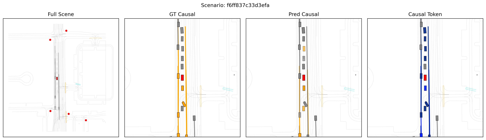
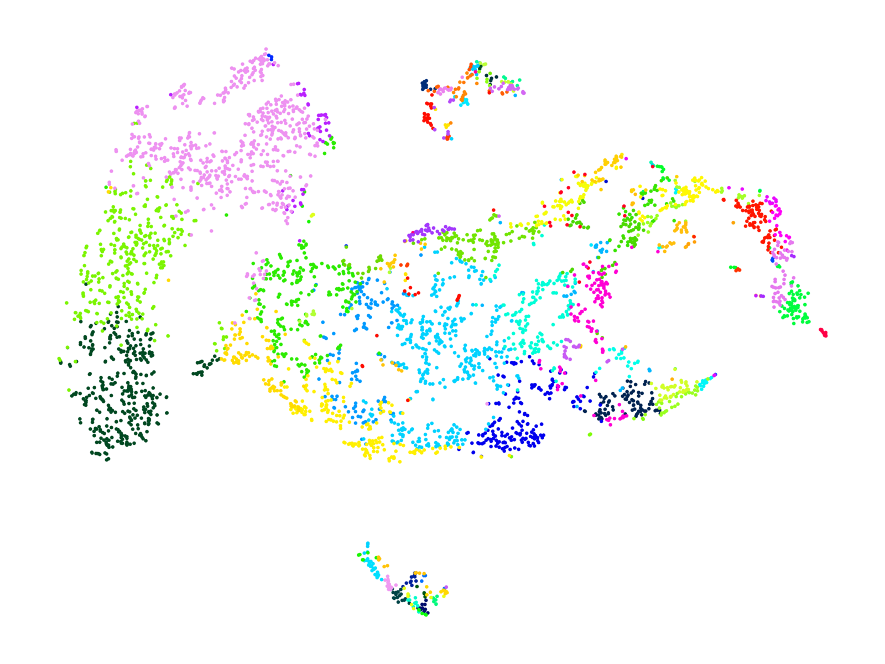
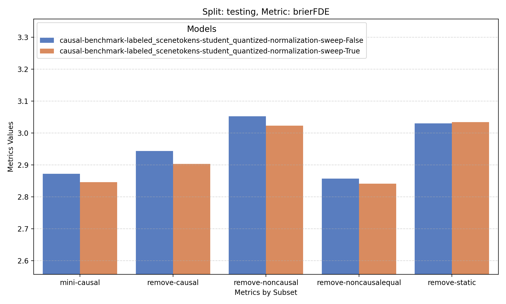

# Experiment Analysis

## Scenario Visualization

The file `configs/scenario_visualization.yaml` specifies the configuration parameters to visualize scenarios in the data.

Run a scenario visualizer as:
```bash
uv run -m scenetokens.scenario_visualization \
    experiment_name=[experiment_name] \
    analysis=[visualizer_type] \
    num_batches=[num_batches] \
    num_scenarios=[num_scenarios]
```
where:
* `experiment_name`: is the name of the experiment to analyze. Note that the experiment is assumed to be located at `${batch_cache_path}/${experiment_name}`.
* `analysis`: is either of `default` (the full scenario), `animated` (animated version of `default`), `causal` (scenario with causal labels and predictions), `causal_animated` (animated version of `causal`) or `trajpred` (scenario with trajectory predictions).
* `num_batches`: is the number of cached batches the scenario visualizer script will load.
* `num_scenarios`: is the number of scenarios that will be visualized. The number of scenarios is sampled from the loaded batches if there are more scenarios than those specified.

**Example**: Result using the causal visualizer:



## Model Embedding Analysis

The file `configs/model_analysis.yaml` specifies the configuration parameters to run different analyses.

Run a scenario visualizer as:
```bash
uv run -m scenetokens.model_analysis run_distribution_analysis=true run_dim_reduction_analysis=true run_score_analysis=true
```
the analyses can be run one at a time or all together.

**Example**: scenario codebook visualization.


**Example**: scenario t-SNE visualization.



## Model Metric Analysis


The file `configs/model_metric_analysis.yaml` specifies the configuration to compare the metrics from different models.

Run a scenario visualizer as:
```bash
uv run -m scenetokens.model_metric_analysis group_name=[experiment_group]
```

An example of an expected input to this script is `assets/group.csv`, and an example of a corresponding result is shown below:




# Sample Selection

Cache training set embeddings:
```bash
uv run -m scenetokens.sample_selection -m \
    paths=waymo_causal_labeled model=scenetokens_student sweep_type="_token-conditioning-sweep" \
    ckpt_name=epoch_118 +model.config.sample_selection=true cache=true
```

Run training analysis only:
```bash
uv run -m scenetokens.sample_selection -m run_analysis=true
```
Run training experiment using blacklist created by sample selection experiment.

# Score Distribution Analysis

Visualize the agent score categorical distributions for the agents in a specified dataset:
```bash
uv run src/scripts/visualize_agent_score_distribution.py \
    --data_cache_path /path/to/data_cache
    --data_subsets name-of-training-set,name-of-validation-set,name-of-testing-set
    --output_path /path/to/save/the/plots
```

Output example shown [here](https://github.com/stackav-oss/social-twins/pull/16).
